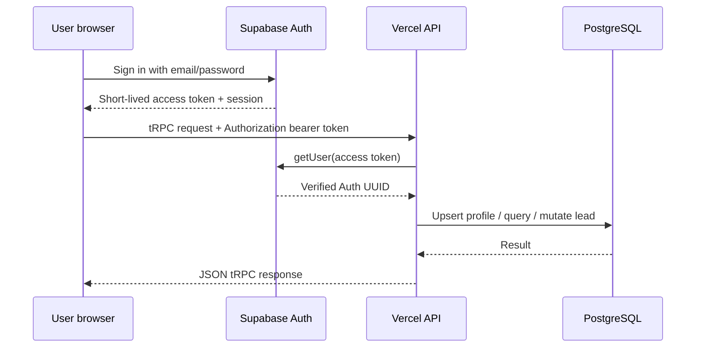

# Devign Lead Forge

Devign Lead Forge is a mobile-first lead operations workspace for a small team of sales, business-development, and client-success agents. It provides authenticated lead intake, shared queue management, atomic ownership claiming, structured status tracking, notes, responsive dashboards, and a same-origin Vercel deployment backed by Supabase Auth and PostgreSQL.

The application is designed around a simple operating principle:

> **Every lead should be easy to capture, easy to understand, safe to claim, and visible to the whole team without allowing accidental ownership conflicts.**

## Product capabilities

The application supports the following end-to-end capabilities.

| Capability                    | Description                                                                                                                                          |
| ----------------------------- | ---------------------------------------------------------------------------------------------------------------------------------------------------- |
| Email/password authentication | Users create accounts, sign in, persist sessions, refresh sessions, and sign out through Supabase Auth.                                              |
| Profile synchronization       | The first authenticated API request creates or updates the matching `public.profiles` record using the Supabase Auth UUID.                           |
| Lead creation                 | Users can create a lead with only a **Name**. Contact, Email, Type, Address, Notes, and Demo Link are optional.                                      |
| Lead editing                  | Authorized users can edit lead details, status, notes, and optional business context.                                                                |
| Lead deletion                 | The creator or an authorized administrator can delete a lead through the protected API.                                                              |
| Shared lead queue             | Authenticated users see a shared, searchable queue of leads ordered by recent activity.                                                              |
| Type filtering                | Leads can be filtered by the existing `source` field, presented in the UI as Type.                                                                   |
| Status filtering              | Leads can be filtered by Finessing, Sold, Cold, or Pipeline customer.                                                                                |
| Claim filtering               | Users can filter the queue by all, claimed, or unclaimed leads.                                                                                      |
| Atomic lead claiming          | A database RPC performs the null-to-owner transition atomically so two agents cannot successfully claim the same lead.                               |
| Ownership locking             | Once claimed, a lead is locked to its owner for protected edit/delete operations.                                                                    |
| Claim conflict handling       | Stale queues and simultaneous claims return a clear conflict message and refresh the queue rather than exposing a raw database exception.            |
| Notes                         | Free-form context, next steps, and follow-up details are stored and displayed on desktop and mobile.                                                 |
| Status workflow               | New leads default to Finessing and can move through the requested operational states.                                                                |
| Responsive mobile interface   | Narrow screens use stacked lead cards, compact statistics, full-width actions, and a scrollable lead dialog instead of forcing a wide desktop table. |
| Desktop interface             | Larger screens use a dense searchable table with status badges, notes, claim state, links, and row actions.                                          |
| Optional analytics            | Umami loads only when its optional endpoint and website ID are configured; missing analytics configuration does not block the application.           |

## High-level architecture

The production system is a same-origin browser application. Vercel serves the static React/Vite frontend and the Node.js API function. Supabase supplies authentication and PostgreSQL persistence. The browser never receives the database password or a service-role credential.

```mermaid
flowchart TD
    Browser[Mobile or desktop browser\nReact 19 + Vite]
    Auth[Supabase Auth\nEmail/password sessions]
    Client[tRPC client\nBearer access token]
    API[Vercel Node Function\n/api/trpc/*]
    Middleware[tRPC protected procedures\nToken verification + ownership rules]
    DB[Supabase PostgreSQL\nSession Pooler]
    RPC[public.claim_lead\nAtomic ownership transition]
    Profiles[(public.profiles)]
    Leads[(public.leads)]

    Browser --> Auth
    Browser --> Client
    Client -->|Authorization: Bearer <token>| API
    API --> Middleware
    Middleware -->|getUser(token)| Auth
    Middleware --> DB
    DB --> Profiles
    DB --> Leads
    Middleware --> RPC
    RPC --> Leads
```

### Runtime responsibilities

| Layer                  | Technology                                        | Responsibility                                                                                                                   |
| ---------------------- | ------------------------------------------------- | -------------------------------------------------------------------------------------------------------------------------------- |
| Presentation           | React 19, Vite, Tailwind CSS, Radix UI primitives | Authentication screens, lead workspace, responsive cards/table, dialogs, filters, badges, toasts, and actions.                   |
| Browser authentication | `@supabase/supabase-js`                           | Sign-up, sign-in, session persistence, session refresh, auth-state events, and sign-out.                                         |
| Browser data client    | tRPC React client, TanStack Query, SuperJSON      | Typed API calls, request caching, query invalidation, optimistic-feeling refresh behavior, and JSON-safe serialization.          |
| API boundary           | Vercel Node function at `api/trpc/[...path].ts`   | Receives `/api/trpc/*`, invokes the Express/tRPC application, and returns JSON responses.                                        |
| API framework          | Express and tRPC                                  | Request adaptation, bearer extraction, authentication middleware, validation, authorization, lead procedures, and error mapping. |
| Validation             | Zod                                               | Validates lead input, UUIDs, filters, status values, optional URLs, and email values.                                            |
| Server authentication  | Supabase Auth `getUser(accessToken)`              | Verifies the short-lived bearer token and establishes the authoritative authenticated UUID.                                      |
| Database access        | `postgres` over Supabase Session Pooler           | Performs server-side lead CRUD and profile lookups after API authentication.                                                     |
| Atomic ownership       | Supabase PostgreSQL RPC `public.claim_lead(uuid)` | Performs the race-safe claim transition using the authenticated database identity.                                               |
| Styling                | Tailwind CSS and project UI primitives            | Responsive layout, status tones, cards, dialogs, controls, spacing, and mobile readability.                                      |
| Hosting                | Vercel connected to GitHub                        | Builds `main`, serves the Vite output, and runs the API function.                                                                |

## Request and authorization flow

The browser uses Supabase Auth to obtain a session. The tRPC client reads the current access token and sends it to the same-origin `/api/trpc` endpoint as a bearer token. The API verifies the token with Supabase Auth before allowing any protected lead operation.



The browser does not send an owner ID that the server trusts. For creates, the API writes the verified Auth UUID to `created_by_id`. For updates and deletes, the API reads the lead and enforces ownership or administrator access. For claims, the API first checks that the row exists and is unclaimed, then invokes the atomic database function. A simultaneous claim can therefore produce a conflict, but it cannot silently overwrite another owner.

## Lead lifecycle and status model

Every new lead defaults to **Finessing**. The status is stored in the existing `public.leads.status` column and exposed with human-readable labels in the UI.

| Internal value | Display label         | Operational meaning                                              |
| -------------- | --------------------- | ---------------------------------------------------------------- |
| `finessing`    | **Finessing**         | The team is currently working the lead or keeping it on standby. |
| `sold`         | **Sold**              | The opportunity closed successfully.                             |
| `cold`         | **Cold**              | There was no response, or the prospect is not interested.        |
| `pipeline`     | **Pipeline customer** | The person or company is a returning customer in the pipeline.   |

Legacy rows with a previous `new` status are normalized to Finessing on read. This allows the current workflow to coexist with existing production data without requiring a destructive schema rewrite.

## Lead data contract

The UI uses business-friendly field names while the API maps them onto the already-provisioned database columns.

| UI field    |          Required | Existing storage                | Behavior                                                                                        |
| ----------- | ----------------: | ------------------------------- | ----------------------------------------------------------------------------------------------- |
| Name        |               Yes | `title`, `company_name`         | Written to both required name columns.                                                          |
| Contact     |                No | `contact_name`, `contact_phone` | The API splits `Name · Phone` at the first middle dot. A contact name without a phone is valid. |
| Email       |                No | `contact_email`                 | Validated only when provided. Blank values become `NULL`.                                       |
| Type        |                No | `source`                        | Used by the Type filter.                                                                        |
| Address     |                No | `notes`                         | Stored as the unmarked notes content for backward compatibility.                                |
| Notes       |                No | `notes`                         | Stored with a `Notes:` marker so it remains distinct from Address.                              |
| Demo Link   |                No | `notes`                         | Stored with a `Demo Link:` marker and validated as a URL when provided.                         |
| Status      |                No | `status`                        | Defaults to `finessing`; accepted values are constrained by Zod.                                |
| Claim owner | Server-controlled | `claimed_by`, `claimed_at`      | Set only by the atomic claim workflow.                                                          |

The existing `notes` column is intentionally reused. The application parses and composes the address, internal notes, and demo-link markers without adding a new production column or running a migration.

## API procedures

The main tRPC router is defined in `server/routers.ts`.

| Procedure      | Type     | Authentication             | Purpose                                                                |
| -------------- | -------- | -------------------------- | ---------------------------------------------------------------------- |
| `auth.me`      | Query    | Public                     | Returns the authenticated user context when available.                 |
| `leads.list`   | Query    | Protected                  | Lists leads using search, Type, claim status, and lead status filters. |
| `leads.create` | Mutation | Protected                  | Creates a lead using the verified user as `created_by_id`.             |
| `leads.update` | Mutation | Protected                  | Updates an accessible lead, including status and notes.                |
| `leads.remove` | Mutation | Protected                  | Deletes an accessible lead.                                            |
| `leads.claim`  | Mutation | Protected                  | Atomically claims an unclaimed lead for the verified user.             |
| `system.*`     | Router   | Internal/public as defined | Provides the project’s system-level router procedures.                 |

Every protected procedure depends on a verified Supabase access token. Invalid input is rejected before database work begins, and server-side errors are converted into JSON tRPC responses rather than being allowed to fall through to HTML or plain-text responses.

## Database model

The active production schema is authoritative. The TypeScript Drizzle schema mirrors it for typing and documentation, but the application is not currently using Drizzle migrations to alter the provisioned Supabase database.

| Table or function                   | Important fields / behavior                                                                                                                    |
| ----------------------------------- | ---------------------------------------------------------------------------------------------------------------------------------------------- |
| `public.profiles`                   | Auth UUID primary key, display name, email, role, and timestamps.                                                                              |
| `public.leads`                      | Name fields, contact fields, source/type, status, claim ownership, notes, creator, and timestamps.                                             |
| `public.claim_lead(p_lead_id uuid)` | Atomic null-to-owner transition used by the claim procedure.                                                                                   |
| Row-level security                  | Enabled on the provisioned tables. Anonymous browser requests do not receive lead access. API authorization remains the primary CRUD boundary. |

### Important schema constraint

Do not run `pnpm drizzle-kit migrate`, `pnpm db:push`, or a generated migration against the production Supabase project unless the target schema has been separately verified and a deliberate migration plan has been approved. The live schema already exists and contains the columns required by the application.

## Security model

The public Vite variables are safe for browser use because they identify the Supabase project and authorize the public Auth client according to Supabase policy. They are not database credentials. The `SUPABASE_DATABASE_URL` value is server-only and must never be prefixed with `VITE_`, committed to Git, printed in logs, or exposed in browser code.

The security boundaries are distributed deliberately:

1. **Supabase Auth** verifies email/password identities and issues access tokens.
2. **The API** validates the bearer token and derives the authoritative Auth UUID.
3. **Zod** rejects malformed data before database procedures run.
4. **The API router** enforces ownership and claim rules.
5. **PostgreSQL** performs database persistence and atomic claiming.
6. **Row-level security** remains enabled in the provisioned Supabase schema.
7. **The browser** cannot substitute another user’s UUID or database connection string.

A publishable Supabase key may be used by the browser Auth client. A service-role key or Postgres password must not be placed in the frontend.

## Repository structure

```text
.
├── api/
│   └── trpc/[...path].ts       # Vercel catch-all tRPC function
├── client/
│   ├── index.html               # Browser entry document
│   └── src/
│       ├── _core/               # Auth hooks and shared client behavior
│       ├── components/          # Dashboard shell and reusable UI
│       ├── lib/                 # Supabase client and tRPC client setup
│       ├── pages/Home.tsx       # Lead workspace, cards, table, filters, dialogs
│       └── index.css             # Global responsive styling
├── drizzle/
│   └── schema.ts                # TypeScript mirror of the provisioned schema
├── server/
│   ├── _core/                   # API context, environment, tRPC, Express adapter
│   ├── db.ts                    # Server-side SQL, mapping, and lead persistence
│   ├── routers.ts               # Typed API procedures and authorization rules
│   ├── supabaseAuth.ts          # Request-scoped Supabase Auth verification
│   └── *.test.ts                # Auth, API, CRUD, and deployment boundary tests
├── shared/
│   └── const.ts                 # Shared constants used by client and server
├── scripts/
│   └── verify-supabase-contract.mjs
├── supabase/
│   └── migrations/              # Historical/reference SQL; not automatic production migrations
├── SUPABASE_VERCEL_SETUP.md     # Detailed environment and deployment runbook
├── supabase_schema_contract.md  # Production schema contract notes
├── vercel.json                  # API-safe Vercel routing and build configuration
├── vite.config.ts               # Vite build configuration
├── tsconfig.json                # TypeScript configuration
└── package.json                 # Scripts and dependencies
```

## Responsive interface behavior

The interface is optimized for mobile first while retaining a data-dense desktop view.

| Viewport      | Behavior                                                                                                                              |
| ------------- | ------------------------------------------------------------------------------------------------------------------------------------- |
| Narrow mobile | Stacked lead cards, compact status badges, wrapped emails/notes, full-width Add Lead and Claim actions, and a scrollable form dialog. |
| Tablet        | Mobile card layout remains readable while controls gain additional horizontal room.                                                   |
| Desktop       | Search and filters share a toolbar, and a horizontally scrollable table exposes the full lead record and row actions.                 |

The mobile card intentionally avoids forcing users to pinch-zoom a wide table. Long text is wrapped safely, empty values display as an em dash, and optional demo links are omitted when absent.

## Configuration

Set the following variables in Vercel for every environment that will be used. Public variables are embedded during the Vite build; server-only variables are read by the API function at runtime.

| Variable                        |    Required | Visibility  | Purpose                                                           |
| ------------------------------- | ----------: | ----------- | ----------------------------------------------------------------- |
| `VITE_SUPABASE_URL`             |         Yes | Public      | Supabase project URL for the browser Auth client.                 |
| `VITE_SUPABASE_PUBLISHABLE_KEY` |         Yes | Public      | Supabase publishable key for browser authentication.              |
| `SUPABASE_DATABASE_URL`         |         Yes | Server-only | Supabase Session Pooler URI for server-side PostgreSQL access.    |
| `SUPABASE_URL`                  | Recommended | Server-only | Explicit server-side Supabase URL; falls back to the Vite URL.    |
| `SUPABASE_PUBLISHABLE_KEY`      | Recommended | Server-only | Explicit server-side publishable key; falls back to the Vite key. |
| `VITE_APP_TITLE`                |    Optional | Public      | Browser title and application branding.                           |
| `VITE_ANALYTICS_ENDPOINT`       |    Optional | Public      | Umami analytics endpoint.                                         |
| `VITE_ANALYTICS_WEBSITE_ID`     |    Optional | Public      | Umami website identifier.                                         |

Use the exact Session Pooler URI supplied by Supabase. URL-encode special characters in the database password, especially `@`, `:`, `/`, `?`, and `#`. If a Vercel environment variable changes, create a new deployment because Vite public values are embedded at build time and server functions receive the new value only in a new build/runtime.

## Local development

Install dependencies with the repository’s locked package manager and create a local environment file through Vercel rather than committing credentials.

```bash
pnpm install
pnpm add -g vercel
vercel login
vercel link
vercel env pull .env.local
pnpm dev
```

For a Vercel-shaped local function environment:

```bash
pnpm dev:vercel
```

The regular development command starts the TypeScript server with `tsx` watch mode. The Vercel command exercises the deployment-shaped routing and function behavior. Keep `.env.local` out of Git.

## Commands

| Command             | Purpose                                                                                                    |
| ------------------- | ---------------------------------------------------------------------------------------------------------- |
| `pnpm dev`          | Start the development server with TypeScript watch mode.                                                   |
| `pnpm dev:vercel`   | Run the project using Vercel’s local development environment.                                              |
| `pnpm check`        | Run TypeScript with `--noEmit`.                                                                            |
| `pnpm test`         | Run the Vitest suite once.                                                                                 |
| `pnpm build:vercel` | Type-check and build the Vite frontend for Vercel.                                                         |
| `pnpm build`        | Build the frontend and bundle the standalone server entrypoint.                                            |
| `pnpm start`        | Start the generated production server bundle.                                                              |
| `pnpm format`       | Format repository files with Prettier.                                                                     |
| `pnpm db:generate`  | Generate Drizzle artifacts; review carefully before any database action.                                   |
| `pnpm db:push`      | Generate and apply Drizzle migrations; do not run against the existing production schema without approval. |

## Testing and verification

The test suite covers the authentication boundary, logout behavior, Supabase client configuration, API JSON responses, Vercel entrypoint behavior, lead CRUD paths, invalid input, ownership enforcement, and atomic claim conflicts.

Run the normal local checks before pushing:

```bash
pnpm check
pnpm test
pnpm build:vercel
```

The two configuration tests that directly contact Supabase require the corresponding environment variables. In a clean sandbox without those values, the application type check and production build can still pass while those environment-dependent tests fail.

After deployment, verify the following sequence:

| Test                                       | Expected result                                                                                     |
| ------------------------------------------ | --------------------------------------------------------------------------------------------------- |
| Open the production URL                    | The sign-in panel renders without an Auth configuration error.                                      |
| Create or invite an account                | Supabase creates the account or requests confirmation according to project policy.                  |
| Sign in and refresh                        | The session persists and the profile is synchronized.                                               |
| Create a name-only lead                    | The lead is accepted with optional fields blank.                                                    |
| Add notes and status                       | Notes and the selected status round-trip through the API and UI.                                    |
| Filter by status                           | Only leads matching the selected status appear.                                                     |
| Claim an unclaimed lead                    | The lead becomes locked to the claiming agent.                                                      |
| Claim the same lead concurrently           | One request wins; the other receives a clear conflict and refreshes.                                |
| Edit or delete an owned lead               | The operation succeeds.                                                                             |
| Edit or delete another user’s claimed lead | The API rejects the operation and the UI does not offer unsafe actions.                             |
| Test a narrow viewport                     | Cards, dialogs, buttons, notes, and status badges remain readable without horizontal page overflow. |

## Vercel deployment

The repository is connected to GitHub repository `Keyayco/Devign-Lead-Forge` and deploys from the `main` branch.

| Vercel setting   | Value                                  |
| ---------------- | -------------------------------------- |
| Framework preset | Vite                                   |
| Root directory   | Repository root                        |
| Install command  | `pnpm install`                         |
| Build command    | `pnpm build:vercel`                    |
| Output directory | `dist/public`                          |
| API route        | `api/trpc/[...path].ts`                |
| Runtime          | Automatic Node.js runtime              |
| Production URL   | `https://devign-lead-forge.vercel.app` |

The checked-in routing keeps `/api` and `/api/*` out of the SPA rewrite so tRPC requests reach the function instead of receiving `index.html`. Avoid replacing the API-safe rewrite with an unconditional catch-all SPA rewrite.

The normal deployment sequence is:

```bash
git status --short
git diff --check
pnpm check
pnpm test
pnpm build:vercel
git add .
git commit -m "describe the change"
git push origin main
```

Vercel then creates a production deployment from the pushed commit. Inspect the Vercel deployment logs whenever a build or function error occurs. If a database connection fails, verify the Session Pooler host, port, URL-encoded password, Vercel environment scope, and the fact that the variable was added before the latest deployment.

## Operational troubleshooting

### “Supabase Auth is not configured”

The production bundle was built without one or both public Vite variables. Add `VITE_SUPABASE_URL` and `VITE_SUPABASE_PUBLISHABLE_KEY` to the correct Vercel environment and redeploy.

### “Invalid login credentials”

Confirm that the user exists in the same Supabase project referenced by `VITE_SUPABASE_URL`, that the password is current, and that email confirmation policy has been satisfied. A user existing in a different Supabase project will not authenticate against this deployment.

### “Not valid JSON” during lead submission

This usually indicates that the browser received a Vercel HTML or plain-text function failure instead of a tRPC JSON response. Inspect the function logs, confirm the API route is deployed, verify `SUPABASE_DATABASE_URL`, and check that the latest commit includes the Vercel API handler and server ESM import fixes.

### Database password authentication failure

Check the Session Pooler URI in Vercel. Use the exact URI from Supabase’s Database connection settings, URL-encode the password, apply it to Production, and create a new deployment.

### Atomic claim conflict

A claim conflict means the requested row was already claimed or no longer exists in the current database state. Refresh the queue and retry another unclaimed lead. The API intentionally prevents reassignment and now returns a user-facing conflict message instead of exposing the raw Supabase exception.

### Queue fails to load

Confirm the browser session is active, the tRPC request contains a bearer token, the API function is resolving under `/api/trpc`, and the server-only database variable is present in the deployed environment. Check Vercel runtime logs for connection, module-resolution, or authorization errors.

## Design and engineering decisions

The project intentionally favors a small, explicit architecture over a larger service layer. React and Vite keep the browser bundle straightforward. tRPC and Zod provide a typed API contract. Supabase Auth avoids custom password handling. PostgreSQL remains the source of truth for ownership and atomic claim behavior. The API uses the server-only Session Pooler connection so browser users cannot directly perform privileged lead CRUD with a public key.

The current schema is treated as an external production contract. The application maps new workflow concepts such as internal notes and status labels onto existing columns rather than casually adding migrations. This reduces deployment risk and keeps the application compatible with the provisioned Supabase project.

## References

[1]: https://supabase.com/docs/guides/auth "Supabase Auth documentation"
[2]: https://supabase.com/docs/guides/database/postgres/row-level-security "Supabase Row Level Security documentation"
[3]: https://vercel.com/docs/frameworks/frontend/vite "Vercel Vite deployment documentation"
[4]: https://trpc.io/docs "tRPC documentation"
[5]: https://zod.dev/ "Zod documentation"
[6]: SUPABASE_VERCEL_SETUP.md "Repository Supabase and Vercel setup runbook"
[7]: supabase_schema_contract.md "Repository production schema contract"

## License

This project is licensed under the MIT License.
