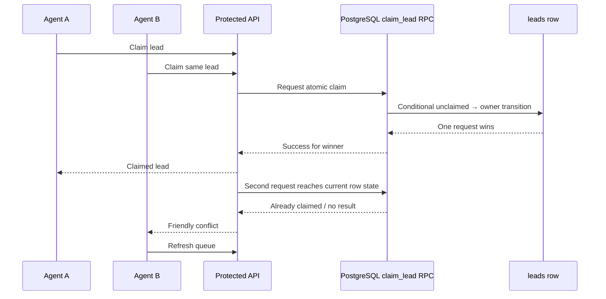

# Devign Lead Forge — Actual Architecture

## Purpose and boundary

Devign Lead Forge is a focused, mobile-first internal lead operations workspace for Devign’s sales and business-development team. It is deliberately not a generic CRM and it is not the Devign Client Portal.

> **Core principle:** Every lead should be easy to capture, easy to understand, safe to claim, and visible to the whole team without allowing accidental ownership conflicts.

The **Devign Client Portal is a separate application**. Lead Forge may link to it when a configurable URL is present and when the team knows that a lead is already an appropriate client, but Lead Forge does not embed its client-facing functionality, data model, billing, invoicing, or project-management workflows.

## System map

```mermaid
flowchart TD
    Forge[DEVIGN LEAD FORGE]
    Capture[CAPTURE\nCreate\nEdit\nContext]
    Operate[OPERATE\nQueue\nSearch\nFilter\nClaim]
    Measure[MEASURE\nDashboard\nKPIs\nActivity]
    Understand[UNDERSTAND\nProfile\nNotes\nHistory\nNext available action]
    Work[WORK\nStatus\nFollow-up context\nDemo\nContact]
    PG[(Supabase PostgreSQL)]
    RPC[Atomic Claim RPC\npublic.claim_lead(uuid)]
    Auth[Supabase Auth]
    Portal[Separate Devign Client Portal\noptional external link]
    Analytics[Optional Umami\nnon-blocking]

    Forge --> Capture
    Forge --> Operate
    Forge --> Measure
    Operate --> Understand
    Operate --> Work
    Understand --> PG
    Work --> PG
    PG --> RPC
    RPC --> Auth
    Forge -. configured external link .-> Portal
    Forge -. optional script .-> Analytics
```

The product lifecycle is expressed as:

```text
CAPTURE → UNDERSTAND → CLAIM → WORK → FOLLOW-UP → PIPELINE → CLOSE
```

The current database supports the operational facts needed by this lifecycle: lead identity, contact context, notes, type/source, status, timestamps, creator, claimant, and claim time. It does not currently provide a structured activity-event table or a structured next-step field. The UI therefore presents the available context and timestamps honestly rather than inventing a history system or silently changing the production schema.

## Runtime topology

| Layer                  | Actual implementation                                   | Responsibility                                                                                            |
| ---------------------- | ------------------------------------------------------- | --------------------------------------------------------------------------------------------------------- |
| Browser                | React 19, Vite, Tailwind CSS, Radix-based UI components | Authentication screens, responsive lead queue, filters, forms, brief dialog, status and claim actions.    |
| Browser Auth client    | Supabase JavaScript client                              | Email/password registration, login, session persistence, refresh, auth-state events, and logout.          |
| Browser API client     | tRPC React client with TanStack Query                   | Typed requests, query state, cache invalidation, and bearer-token transport.                              |
| API entrypoint         | `api/trpc/[...path].ts` on Vercel                       | Same-origin catch-all function that invokes the Express/tRPC application.                                 |
| Backend router         | Express 4 and tRPC 11                                   | Token verification, protected procedures, Zod validation, authorization checks, and JSON error responses. |
| Server database access | `postgres` through Supabase Session Pooler              | Profile lookup/upsert and lead CRUD using the server-only database URI.                                   |
| Auth verification      | Supabase Auth `getUser(accessToken)`                    | Establishes the authoritative authenticated Supabase UUID.                                                |
| Lead ownership         | PostgreSQL and `public.claim_lead(uuid)`                | Performs the atomic null-to-owner transition.                                                             |
| Hosting                | Vercel connected to GitHub                              | Builds the Vite application and runs the Node.js API function.                                            |

The browser and API share the same origin in production. This avoids a separate CORS and cookie architecture: the browser sends the Supabase access token to `/api/trpc`, and the server validates it before touching lead data.

## Frontend

The primary workspace lives in `client/src/pages/Home.tsx`. It preserves the existing queue and adds a Lead Workspace / Lead Brief view so an agent can understand a lead quickly without opening a wide edit form first.

### Queue behavior

The queue supports search by lead name, Type filtering, status filtering, claim filtering, recent-activity ordering, refresh, creation, editing, deletion where authorized, and atomic claiming. Desktop retains a dense table. Narrow screens use cards with the lead name, type, status, contact context, notes, claim state, and a full-width claim action.

### Lead Brief behavior

Opening a lead name on mobile or the brief action on desktop shows the available operational context in a clear hierarchy:

1. **Who is this?** Name, type, and identity.
2. **What do we know?** Contact, email, address, demo link, and notes.
3. **What is its state?** Status badge and ownership state.
4. **Who owns it?** The current claimant, or unclaimed state.
5. **What happened?** Available timestamps such as last update and claim time when exposed by the current model.
6. **What should happen next?** The brief exposes edit, demo, contact, and map actions; it does not fabricate a next-step record that the database does not contain.

Primary actions remain subject to backend authorization. The UI can hide unsafe controls for a lead locked to another agent, but that presentation is not the security boundary.

## API and authorization

The API router is defined in `server/routers.ts`. Protected lead procedures require a verified Supabase access token through the tRPC authentication middleware.

| Procedure      | Behavior                                                                                                                                |
| -------------- | --------------------------------------------------------------------------------------------------------------------------------------- |
| `leads.list`   | Returns leads with search, Type, claim-status, and status filters.                                                                      |
| `leads.create` | Validates the input and writes the verified user UUID as `created_by_id`.                                                               |
| `leads.update` | Re-reads the lead and rejects edits to a lead claimed by another user.                                                                  |
| `leads.remove` | Re-reads the lead and applies the existing server-side access rule before deletion.                                                     |
| `leads.claim`  | Checks current state, invokes the database RPC, maps stale-race failures to a friendly conflict, and refreshes the queue on the client. |

The client never supplies a trusted substitute owner ID. A user’s identity comes from Supabase Auth verification, and the server remains responsible for ownership and deletion authorization.

## Profiles and authentication

Supabase Auth owns email/password identity and sessions. The first authenticated API request upserts the corresponding row in `public.profiles` using the Supabase Auth UUID. The active profile fields include display name, email, role, and timestamps.

The browser may receive the Supabase project URL and publishable key. It must never receive a database password or Supabase service-role key. Session refresh and logout remain enabled, and authentication is not weakened to make the workspace more convenient.

## PostgreSQL and lead model

The existing Supabase schema is authoritative. The repository’s TypeScript schema mirrors the provisioned tables for typing and documentation, but purely visual or workflow improvements do not require a new migration.

| Existing field                  | Current use                                                                                |
| ------------------------------- | ------------------------------------------------------------------------------------------ |
| `title`, `company_name`         | Lead Name. The API writes the submitted Name to both required text fields.                 |
| `contact_name`, `contact_phone` | Contact display value, split at the first middle dot.                                      |
| `contact_email`                 | Optional email.                                                                            |
| `source`                        | UI Type field and Type filter.                                                             |
| `status`                        | Finessing, Sold, Cold, or Pipeline Customer workflow.                                      |
| `notes`                         | Address, internal notes, and demo-link markers composed safely for backward compatibility. |
| `created_by_id`                 | Authenticated creator UUID.                                                                |
| `claimed_by`, `claimed_at`      | Server-controlled ownership state.                                                         |
| `created_at`, `updated_at`      | Available timestamps and recent-activity ordering.                                         |

A lead can be created with only **Name**. Contact, Email, Type, Address, Notes, and Demo Link remain optional. Zod validates Name, email syntax when supplied, URL syntax when supplied, field lengths, and allowed status values.

## Status workflow

The current operational status model is intentionally preserved.

| Value       | Display           | Meaning                               |
| ----------- | ----------------- | ------------------------------------- |
| `finessing` | Finessing         | Currently being worked or on standby. |
| `sold`      | Sold              | Closed successfully.                  |
| `cold`      | Cold              | No response or not interested.        |
| `pipeline`  | Pipeline Customer | Returning customer in the pipeline.   |

Legacy `new` rows are read as Finessing so existing records remain usable. A secondary Kanban view is not required for the current queue to remain efficient and has not been made mandatory.

## Atomic ownership claiming

Claiming is intentionally a database operation rather than a client-side read followed by a write.



Only one simultaneous request can win. The losing agent receives a conflict message rather than a raw PostgreSQL error, and the client invalidates the lead list so the queue reflects the database source of truth.

## Optional analytics

Umami is loaded only when both `VITE_ANALYTICS_ENDPOINT` and `VITE_ANALYTICS_WEBSITE_ID` are configured. Missing analytics configuration does not prevent login, queue loading, lead creation, editing, claiming, or deletion. Analytics is an optional observation layer, not a runtime dependency.

## Client Portal boundary

The Client Portal is a different application. Lead Forge does not embed client-facing portal functionality or attempt to share its internal lead workflow with the portal.

When `VITE_CLIENT_PORTAL_URL` is configured, Lead Forge shows a clearly labeled external **Client Portal ↗** link in navigation. The URL is configured once through the environment rather than hardcoded in multiple components. The lead brief may link to the portal only after the team has established that the lead is an appropriate client; Lead Forge does not misleadingly claim that every lead already has a portal record.

If the URL is not configured, no broken or invented portal link is shown.

## Deployment

Vercel serves the Vite output from `dist/public` and routes `/api/trpc/*` to `api/trpc/[...path].ts`. The SPA rewrite excludes `/api` so tRPC requests do not receive `index.html`.

| Setting           | Value                                |
| ----------------- | ------------------------------------ |
| Framework         | Vite                                 |
| Install           | `pnpm install`                       |
| Build             | `pnpm build:vercel`                  |
| Output            | `dist/public`                        |
| API               | `api/trpc/[...path].ts`              |
| Database          | Supabase Session Pooler, server-only |
| Production branch | `main`                               |

Required environment variables are documented in `README.md` and `SUPABASE_VERCEL_SETUP.md`. `VITE_CLIENT_PORTAL_URL`, `VITE_ANALYTICS_ENDPOINT`, and `VITE_ANALYTICS_WEBSITE_ID` are optional public configuration values.

## Deliberate non-goals

The current architecture does not add billing, invoicing, marketing automation, complex permissions, unnecessary AI, file management, a second CRM, Client Portal functionality, microservices, or an unnecessary database migration. The goal is to polish the existing Lead Forge into a fast, focused, reliable operations workspace.

## Verification expectations

Before a release, run the repository type check, tests, and Vercel production build. Verify authentication, name-only lead creation, editing, deletion authorization, claiming, stale-claim conflict handling, filters, the configurable Client Portal link, and analytics behavior with missing configuration. When live Supabase credentials are not present in the local environment, document those runtime checks as environment-dependent rather than weakening the tests or bypassing authentication.
